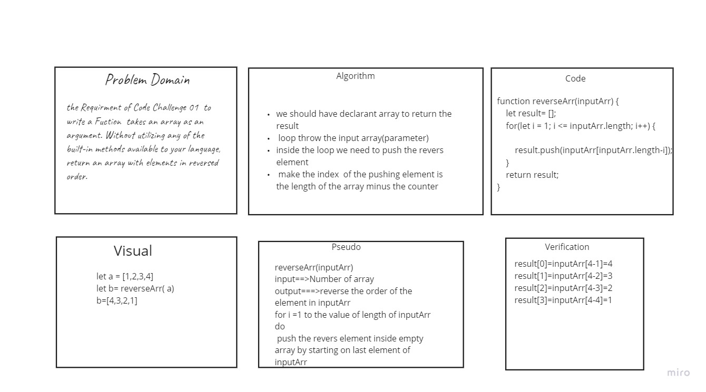

# Challenge Summary
we need function takes in an array and revers the order of the element on it, then return the new ordered array

## Challenge Description
 on this challenge we need to make the order of the array start from back

## Approach & Efficiency

* I determin the the length of array 
* in for loop : each time reduse the itration from the length of array then push the element in that index to emty array

## Solution
* Whiteboard  