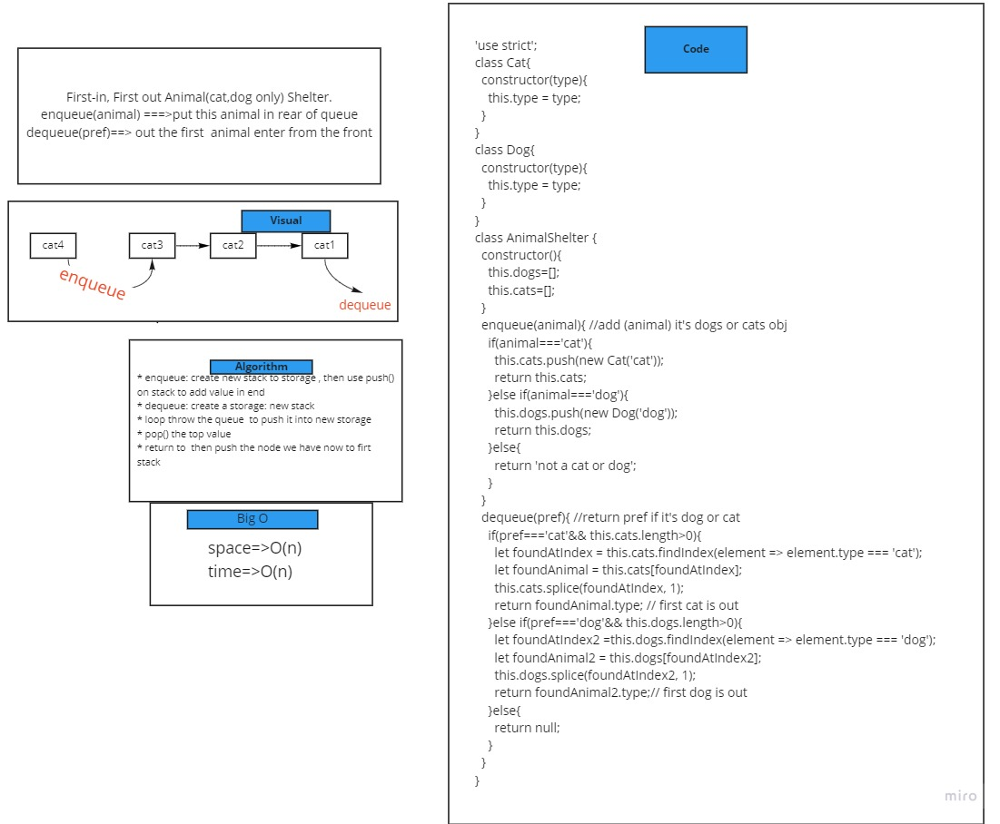

# Challenge Summary
First-in, First out Animal(cat,dog only) Shelter.

enqueue(animal) ===>put this animal in rear of queue

dequeue(pref)==> out the first  animal enter from the front

## Whiteboard Process

## Approach & Efficiency
time performance :``O(n)``
space performance :``O(n)``

## run test 
``npm test fifo-animal-shelter.test.js``
