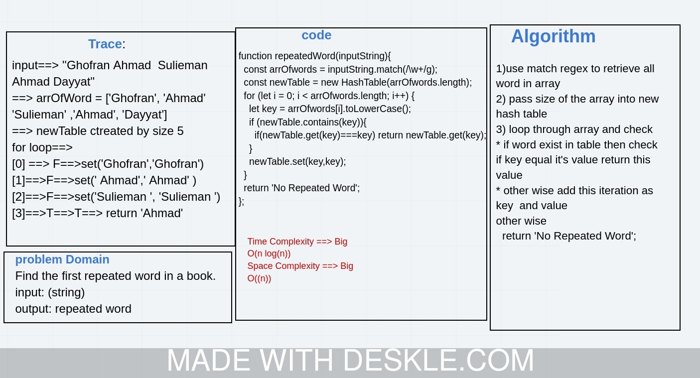

# Challenge Summary
Find the first repeated word in a book.

## Feature Tasks
* Write a function that accepts a lengthy string parameter.
* Without utilizing any of the built-in library methods available to your language, return the first word to occur more 
than once in that provided string.

## Approach & Efficiency
* Time Complexity ``O(n)``
* Space Complexity ``O(n)``

# Run Test 
``npm test repeated-word.test.js``

## Solution

* Whiteboard  