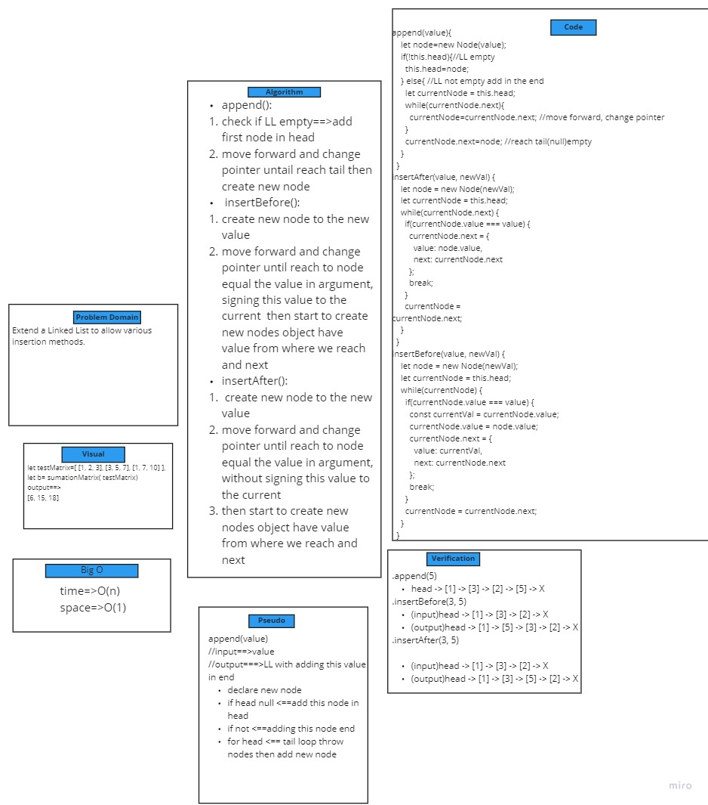
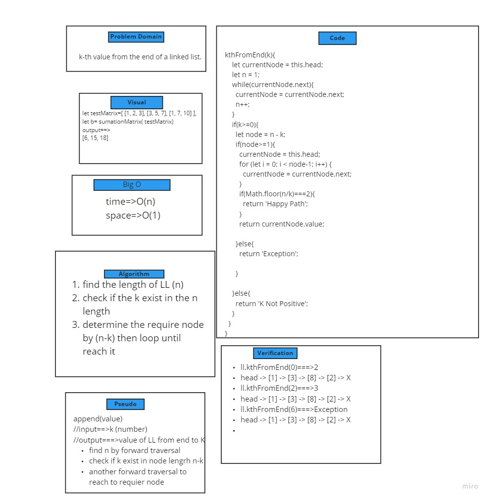
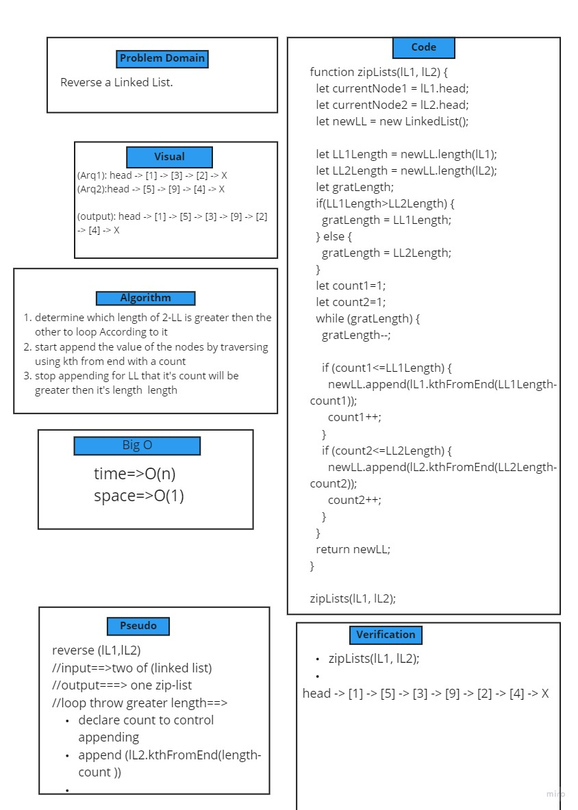

# Challenge Summary class6
create methode to add node :
* in the end 
* after any certine node value
* before any certine node value
## Whiteboard Process

## Approach & Efficiency
O(n)
O(1)
## Solution
* test the unit: ``npm test linked-list-class6.test.js``

# Challenge Summary class7
* create methode   takes a number k, as a parameter. Return the node’s value that is k from the end of the linked list.

## Whiteboard Process

* 
## Approach & Efficiency
O(n)
O(1)
## Solution
* test the unit: ``npm test ll-kth-from-end.test.js``

# Challenge Summary class8
* create zipLists   takes 2-linked list and return Zip two linked lists.

## Whiteboard Process

* 
## Approach & Efficiency
O(n)
O(1)
## Solution
* test the unit: ``npm test ll-zip.test.js``