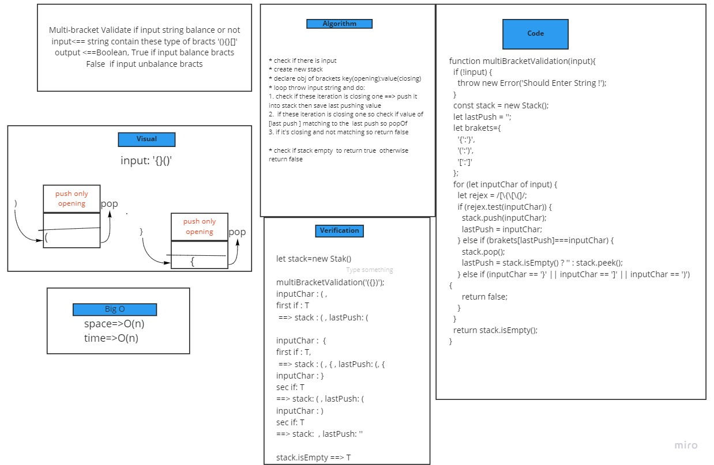

# Challenge Summary
 function should take a string as its only argument, and should return a boolean representing whether or not the brackets in the string are balanced
 brackets of three type ``(){}[]``

## Whiteboard Process

## Approach & Efficiency

``space: O(n)``
``time: O(n)``

## Solution
* to testing ``npm test multi-bracket-validation.test.js``