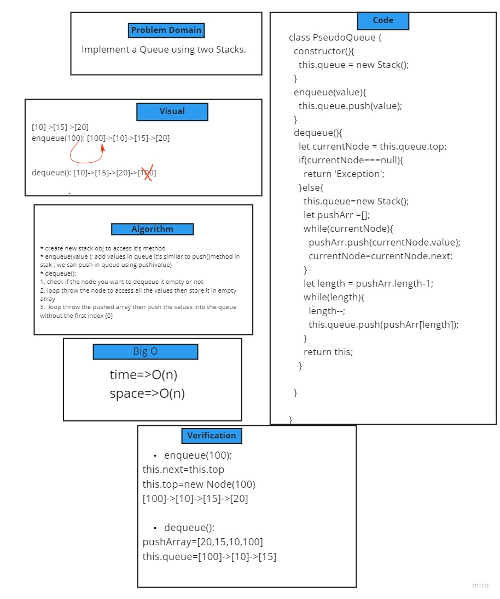

# Challenge Summary
create PseudoQueue class to  implement standard queue with 2-method ``engueue(value)`` & ``dequeue()`` by using Stack Object

## Whiteboard Process

## Approach & Efficiency
time performance :``O(n)``
space performance :``O(n)``

## run test 
``npm test queue-with-stacks.test.js``
