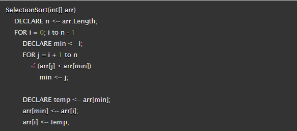
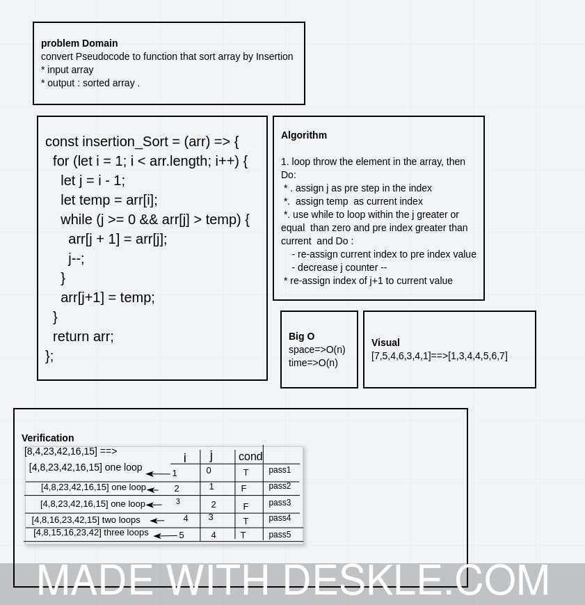

# Challenge Summary
convert  Pseudocode to function that sort array by  Insertion 

# Pseudocode

## Whiteboard Process

## Approach & Efficiency
* timr O(n)
* space O(n)

# Insertion  Sort
- Insertion sort is a simple sorting algorithm that builds the final sorted array (or list) one item at a time. 

